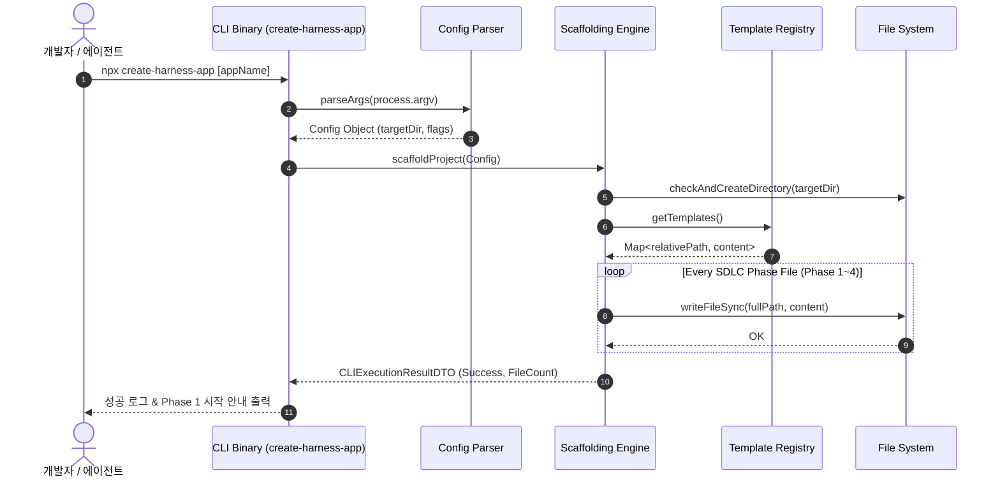

# 04. 시퀀스 다이어그램: 스캐폴딩 실행 파이프라인 (Sequence Diagram)

## 1. CLI 실행 및 SDLC 디렉토리 압착 생성 시퀀스

```mermaid
sequenceDiagram
    autonumber
    actor User as 개발자 / 에이전트
    participant CLI as CLI Binary (create-harness-app)
    participant Parser as Config Parser
    participant Engine as Scaffolding Engine
    participant Registry as Template Registry
    participant FS as File System

    User->>CLI: npx create-harness-app [appName]
    CLI->>Parser: parseArgs(process.argv)
    Parser-->>CLI: Config Object (targetDir, flags)
    
    CLI->>Engine: scaffoldProject(Config)
    Engine->>FS: checkAndCreateDirectory(targetDir)
    
    Engine->>Registry: getTemplates()
    Registry-->>Engine: Map<relativePath, content>
    
    loop Every SDLC Phase File (Phase 1~4)
        Engine->>FS: writeFileSync(fullPath, content)
        FS-->>Engine: OK
    end
    
    Engine-->>CLI: CLIExecutionResultDTO (Success, FileCount)
    CLI-->>User: 성공 로그 & Phase 1 시작 안내 출력
```
