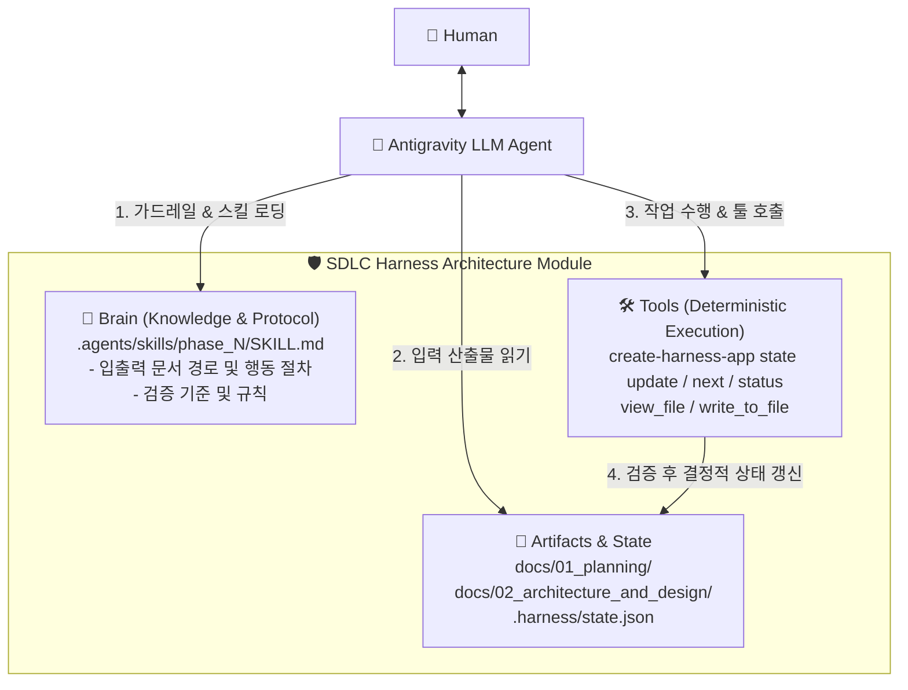

# Antigravity CLI 2.0 기반 하네스 구축 아키텍처 명세

이 문서는 `create-harness-app`이 첫 번째 지원 대상 에이전트인 **Antigravity CLI 2.0**을 기준으로 SDLC 워크플로우 하네스를 스캐폴딩하고 런타임 통제를 수행하기 위한 상세 아키텍처를 정의합니다.

---

## 1. SDLC 스캐폴딩 타깃 디렉토리 아키텍처

`create-harness-app --agent antigravity` 실행 시 생성되는 프로젝트 디렉토리 구조입니다.

```text
my-app/
├── .agents/
│   ├── AGENTS.md                            # Antigravity 전역 가드레일 (프로젝트 제약 및 CLI Tool 규정)
│   └── skills/                              # Phase별 지능형 워크플로우 스킬 패키지
│       ├── phase_1_planning/
│       │   └── SKILL.md                     # Phase 1 기획 (Inputs/Outputs 문서 경로 & 상태 업데이트 지침)
│       ├── phase_2_architecture/
│       │   └── SKILL.md                     # Phase 2 아키텍처 및 인터페이스 설계 스킬
│       └── harness_control/
│           └── SKILL.md                     # 상태 확인/추론 제어 헬퍼 스킬
├── .harness/
│   └── state.json                           # 기계용 런타임 동적 상태 원본 (Go CLI가 관리)
└── docs/                                    # SDLC 단계별 최종 문서/산출물 보관소
    ├── 01_planning/
    └── 02_architecture_and_design/
```

---

## 2. 구성 요소별 역할 및 연동 명세

### 2.1. 전역 가드레일 (`.agents/AGENTS.md`)
* Antigravity 2.0이 프로젝트 진입 시 최우선으로 읽는 시스템 규칙 파일입니다.
* **주요 규정 내용**:
  1. 작업 산출물 생성 후 반드시 `create-harness-app state update` CLI Tool을 호출할 것.
  2. 추측에 의한 작성을 금지하며 선행 Phase의 산출물 문서를 반드시 교차 검증할 것.
  3. 현재 작업 Phase의 대응 스킬(`.agents/skills/phase_N/SKILL.md`)에 명시된 입출력 문서 경로 규칙을 엄격히 준수할 것.

### 2.2. Phase별 지능형 스킬 (`.agents/skills/phase_N/SKILL.md`)
* `blueprint.json`에 정의된 Phase 및 Node 정보를 기반으로 `create-harness-app`이 동적 자동 생성합니다.
* **SKILL.md 포함 내용**:
  * **Inputs**: 해당 Phase 시작 시 읽어야 할 문서 경로 (예: `docs/01_planning/01_user_requirements.md`)
  * **Outputs**: 완료 시 작성해야 할 산출물 문서 경로 (예: `docs/02_architecture_and_design/01_detailed_feature_spec.md`)
  * **Tool Execution**: 완료 시 호출해야 할 `create-harness-app state update --node <id> --status completed` 명령 명세

### 2.3. 결정적 상태 저장소 (`.harness/state.json`) & CLI Tool
* `create-harness-app` Go 런타임이 주관하는 결정적 상태 원본입니다.
* Antigravity LLM은 직접 JSON을 수정하지 않고, `create-harness-app state update` 명령을 호출하여 실제 산출물 실체 검증(Validation Gate) 후 안전하게 원자적 갱신을 수행합니다.

---

## 3. Antigravity LLM - Harness 런타임 상호작용 흐름

1. **상태 및 할 일 조회**:
   Antigravity LLM 또는 사용자가 `create-harness-app next` 또는 `status` 실행 ➔ 현재 미완료된 활성 Phase 및 대응 스킬 경로 확인.
2. **스킬 컨텍스트 로딩**:
   Antigravity LLM이 `.agents/skills/phase_N/SKILL.md`를 로딩하여 입력 문서 파악 및 작성할 출력 문서 목표 설정.
3. **작업 수행 및 산출물 작성**:
   지정된 `docs/` 하위 경로에 결과 마크다운 문서 작성.
4. **결정적 상태 업데이트**:
   Antigravity LLM이 `create-harness-app state update --node <id> --status completed` 실행 ➔ CLI Tool이 파일 존재 여부 검증 후 `.harness/state.json` 완료 처리.

---

## 4. 하네스 3대 삼각 축 (Brain-Artifacts-Tools) 아키텍처 다이어그램



### 삼각 축 구성 요소 역할

1. **🧠 Brain (두뇌 / 지능)**: `.agents/skills/phase_N/SKILL.md` 내에 정의된 입출력 문서 경로 및 검증 절차 지침.
2. **📁 Artifacts & State (아티팩트 & 상태)**: `docs/` 하위 산출물 및 `.harness/state.json` 진척도 원본.
3. **🛠️ Tools (도구 / 실행 엔진)**: `create-harness-app` CLI 및 파일 조작 툴을 통한 결정적 검증 및 상태 갱신.
