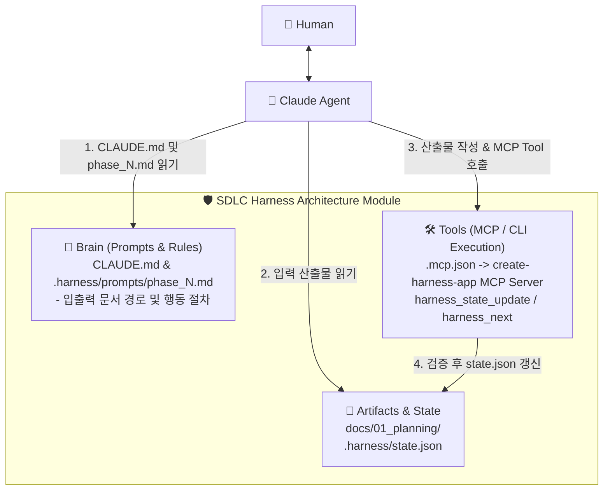

# Claude Agent (Claude Code / CLI) 기반 하네스 구축 아키텍처 명세

이 문서는 `create-harness-app`이 **Claude Agent (Claude Code / CLI)**를 타깃으로 SDLC 워크플로우 하네스를 스캐폴딩하고 런타임 통제를 수행하기 위한 상세 아키텍처를 정의합니다.

---

## 1. SDLC 스캐폴딩 타깃 디렉토리 아키텍처

`create-harness-app --agent claude` 실행 시 생성되는 프로젝트 디렉토리 구조입니다.

```text
my-app/
├── CLAUDE.md                                # Claude 전역 가드레일 (프로젝트 제약 & 하네스 규칙)
├── .mcp.json                                # Claude 네이티브 MCP 도구 연동 설정 (state update 툴 등록)
├── .harness/
│   ├── state.json                           # 기계용 런타임 동적 상태 원본 (Go CLI/MCP가 관리)
│   └── prompts/                             # Phase별 모듈화된 지시어 (Skill 대안)
│       ├── phase_1_planning.md              # Phase 1 기획 지시어 및 입출력 문서 경로
│       └── phase_2_architecture.md          # Phase 2 아키텍처 지시어
└── docs/                                    # SDLC 단계별 최종 문서/산출물 보관소
    ├── 01_planning/
    └── 02_architecture_and_design/
```

---

## 2. 암시적 프롬프트 한계 극복을 위한 아키텍처 보완

Claude는 전용 Skill 바이너리 규격 대신 마크다운 기반 `CLAUDE.md`와 프롬프트 파일에 의존하므로, 자연어 추론의 비결정성(Non-determinism)이 존재합니다. 이를 보완하기 위한 핵심 장치입니다.

### 2.1. `.mcp.json` 기반의 결정적 Validation Gate (MCP Tool)
* Claude가 자연어로 `state.json`을 직접 수정하는 위험을 차단하고, `create-harness-app` MCP Server 도구를 통해 상태를 변경하도록 도구를 직접 주입합니다.
* Claude가 `harness_state_update(node_id, status)` MCP 도구를 호출하면, 백엔드 Go 런타임이 파일 실재 여부 및 스키마 검증 후 동적 상태를 원자적으로 갱신합니다.

### 2.2. 모듈화된 프롬프트 온디맨드 주입 (`.harness/prompts/`)
* 전체 지시어로 인한 프롬프트 비대화를 막기 위해, `CLAUDE.md`에 다음과 같은 강제 수칙을 기재합니다:
  > *"새로운 Phase 작업을 시작하기 전, 반드시 `.harness/prompts/phase_N.md` 파일 전문을 읽고 해당 문서에 지정된 입출력 경로 및 검증 규칙에 따라 작업을 수행하십시오."*

---

## 3. Claude Agent - Harness 런타임 상호작용 흐름



1. **상태 및 할 일 확인**: Claude 또는 사람이 `harness_next` MCP Tool (또는 CLI) 호출 ➔ 다음 미완료 Node 확인.
2. **Phase 프롬프트 주입**: Claude가 `.harness/prompts/phase_N.md`를 열람하여 Input/Output 지정 문서 경로 파악.
3. **산출물 작성**: `docs/` 하위에 요구되는 마크다운 산출물 파일 생성.
4. **결정적 검증 및 상태 갱신**: Claude가 `harness_state_update` MCP Tool 호출 ➔ Go 런타임이 파일 검증 후 `.harness/state.json` 갱신.
